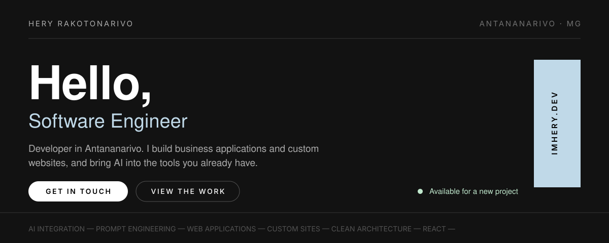

<!-- ════════════════════════════════ HERO ════════════════════════════════ -->

  
  
  

<!-- ════════════════════════════════ WORK ════════════════════════════════ -->

## Projects

<table>
  <tr>
    <td width="50%" valign="top">
      <h3><a href="https://github.com/Hery0019/huffman">huffman</a></h3>
      

        
        
        
      

      
Learn <b>Huffman coding</b> step by step: frequency table, binary tree, compressed output.

      

        
        
      

    </td>
    <td width="50%" valign="top">
      <h3><a href="https://github.com/Hery0019/chess">chess</a></h3>
      

        
        
        
      

      
A full <b>chess game in Java Swing</b>: move rules, turns, game logic. Pure Java, no framework.

      

        
        
      

    </td>
  </tr>
  <tr>
    <td width="50%" valign="top">
      <h3><a href="https://github.com/Hery0019/BoulangeHery">BoulangeHery</a></h3>
      

        
        
        
      

      
<b>Bakery management</b>: products, stock and sales, on a clean relational schema.

      

        
        
      

    </td>
    <td width="50%" valign="top">
      <h3><a href="https://github.com/Hery0019/MobileCrypto">MobileCrypto</a></h3>
      

        
        
        
        
      

      
<b>Crypto wallet mobile app</b>: auth, portfolio, transactions and charts. Team project.

      

        
        
      

    </td>
  </tr>
  <tr>
    <td width="50%" valign="top">
      <h3><a href="https://github.com/Hery0019/prepwork">prepwork</a></h3>
      

        
        
        
        
      

      
<b>Project scaffolding CLI</b>: a ready-to-code skeleton, tooled architecture rules and the specs for the AI agent that codes inside it. Spring Boot &amp; React packs.

      

        
        
      

    </td>
    <td width="50%" valign="top">
      <h3><a href="https://github.com/Hery0019/Ledger">Ledger</a></h3>
      

        
        
        
      

      
An <b>embedded SQL engine in C++20</b> with plain-text storage. A learning project, meant for personal use afterwards.

      

        
        
      

    </td>
  </tr>
</table>

  
  

<!-- ════════════════════════════════ STACK ═══════════════════════════════ -->

## Technologies

The technologies used day to day.

  
  
  
  
  
  

  
  
  
  
  
  

  
  
  
  

<!-- ═════════════════════════════ BACKGROUND ═════════════════════════════ -->

## Education &amp; experience

Two computer science degrees, and shipping production code since 2025.

<table>
  <tr>
    <td width="42%" valign="top">
      

      

        <b>BSc in Computer Science — Development track</b> 
        <a href="https://www.ituniversity-mg.com/">IT University Madagascar</a>
      

      

        <b>BSc in Computer Science</b> 
        <a href="https://cntemad.mg/">CNTEMAD</a>
      

      

      
<b>French &amp; English</b> Fully fluent in both, spoken and written.

    </td>
    <td width="58%" valign="top">
      

      

        SINCE AUG 2026 · PART&#8209;TIME · REMOTE 
        <b>Freelance Developer</b> — Self&#8209;employed 
        Web development for direct clients: building new sites, taking over and improving existing ones.
      

      

        SINCE OCT 2025 · FULL&#8209;TIME · REMOTE 
        <b>Software Developer</b> — <a href="https://optimumsolutions.eu/">Optimum Solutions Ltd</a> 
        HR and CRM business applications, with AI to automate tasks.
      

      

        SINCE OCT 2025 · FULL&#8209;TIME · ON&#8209;SITE 
        <b>Software Engineer</b> — <a href="https://www.solumada.mg/">Solumada</a> 
        Business applications designed with the field teams, including AI solutions that analyse and assess documents.
      

      

        AUG – OCT 2025 · INTERNSHIP · TANJOMBATO 
        <b>Full&#8209;Stack Developer Intern</b> — Circonscription Scolaire Atsimondrano 
        A leave and absence management application for a public institution, replacing paper.
      

    </td>
  </tr>
</table>

<!-- ═══════════════════════════════ GITHUB ═══════════════════════════════ -->

## Contributions

<picture>
  <source media="(prefers-color-scheme: dark)" srcset="https://raw.githubusercontent.com/Hery0019/Hery0019/output/github-contribution-grid-snake-dark.svg"/>
  <source media="(prefers-color-scheme: light)" srcset="https://raw.githubusercontent.com/Hery0019/Hery0019/output/github-contribution-grid-snake.svg"/>
  
</picture>

THE LAST 12 MONTHS

<!-- ═══════════════════════════════ CONTACT ══════════════════════════════ -->

## Let’s work together

Write me a couple of lines, by email or on WhatsApp. I reply within 24 hours, in English or in French.

  
  
  
  

Nothing you write to me is shared.

<!-- ═══════════════════════════════ FOOTER ═══════════════════════════════ -->
<table>
  <tr>
    <td>HERY RAKOTONARIVO — SOFTWARE ENGINEER</td>
    <td align="right">ANTANANARIVO, MADAGASCAR · <a href="https://imhery.dev">IMHERY.DEV</a></td>
  </tr>
</table>
